# Comprehensive Study Guide: Fundamentals of Networks and Cloud Computing

## Table of Contents
1. [Introduction to Computer Networks](#introduction-to-computer-networks)
2. [Network Components and Organization](#network-components-and-organization)
3. [Network Topologies and Types](#network-topologies-and-types)
4. [Message Encoding and Communication](#message-encoding-and-communication)
5. [The OSI Reference Model](#the-osi-reference-model)
6. [The TCP/IP Model](#the-tcpip-model)
7. [Application Layer (Layer 7)](#application-layer-layer-7)
8. [Presentation Layer (Layer 6)](#presentation-layer-layer-6)
9. [Session Layer (Layer 5)](#session-layer-layer-5)
10. [Transport Layer (Layer 4)](#transport-layer-layer-4)
11. [Network Layer (Layer 3)](#network-layer-layer-3)
12. [Data Link Layer (Layer 2)](#data-link-layer-layer-2)
13. [Physical Layer (Layer 1)](#physical-layer-layer-1)
14. [IP Addressing and Subnetting](#ip-addressing-and-subnetting)
15. [Network Address Translation (NAT)](#network-address-translation-nat)
16. [Routing and Path Determination](#routing-and-path-determination)
17. [Protocol Data Units (PDUs)](#protocol-data-units-pdus)
18. [Information Security Principles](#information-security-principles)
19. [Cryptography Fundamentals](#cryptography-fundamentals)
20. [Common Network Attacks and Countermeasures](#common-network-attacks-and-countermeasures)
21. [Network Troubleshooting](#network-troubleshooting)
22. [Key Terminology Glossary](#key-terminology-glossary)

## Introduction to Computer Networks

### Definition and Purpose
Computer networking refers to interconnected computing devices that can exchange data and share resources using a system of rules called communications protocols. Networks enable resource sharing, communication, centralized data storage and management, and provide connectivity between diverse devices.

### Historical Development
Networks have evolved from simple point-to-point connections to complex global systems like the Internet. Key developments include:
- Early mainframe/terminal connections
- Local Area Networks (LANs)
- Wide Area Networks (WANs)
- Internet's evolution from ARPANET
- Wireless networking technologies

## Network Components and Organization

### Physical Components of a Network
Networks consist of three primary categories of components:

**1. End Devices**
- Interface between humans and the network
- Originate or receive data (source or destination)
- Examples: computers, servers, printers, VoIP phones, smartphones, tablets

**2. Intermediary Devices**
- Connect end devices to the network and route/forward data
- Filter data flow based on security settings
- Examples:
    - Switches (forward based on MAC addresses)
    - Routers (forward based on IP addresses)
    - Firewalls (enforce security policies)
    - Wireless Access Points (provide wireless connectivity)

**3. Media**
- Physical pathways for data transmission
- Types:
    - Metallic (copper) cables - Ethernet cables
    - Fiber optic cables - glass or plastic strands
    - Wireless - radio transmission through air

### Network Organization Types

**Peer-to-Peer Networks**
- Devices share resources directly without a dedicated server
- Each device can act as both client and server
- Advantages:
    - Easy to set up
    - Less complex
    - Lower cost
- Disadvantages:
    - No centralized administration
    - Less secure
    - Limited scalability
    - Lower performance with many users
- Best suited for small networks (up to 10 devices)

**Client-Server Networks**
- Uses dedicated servers to provide resources to client devices
- Servers manage resources and access control
- Advantages:
    - Centralized administration
    - Better security
    - Scalable to large environments
    - Higher performance
- Disadvantages:
    - More complex to set up and maintain
    - Higher cost
    - Single point of failure if not redundant
- Best suited for medium to large networks

## Network Topologies and Types

### Physical Topologies

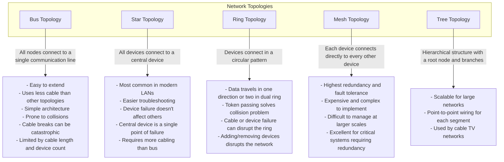

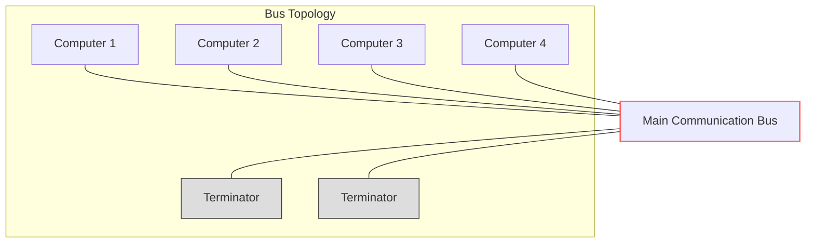

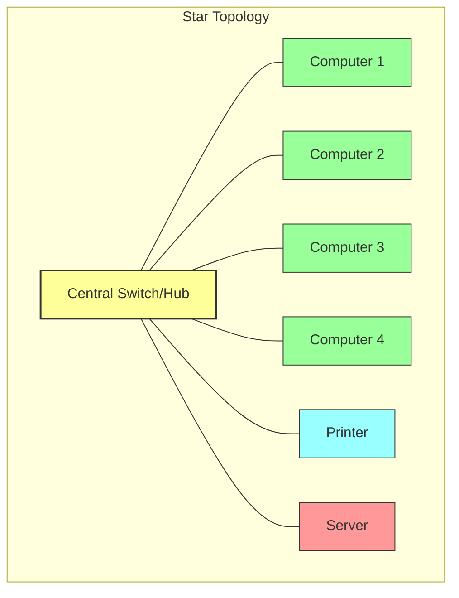

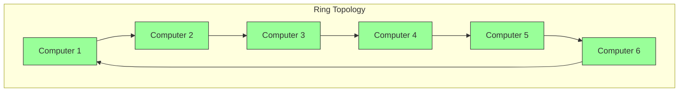

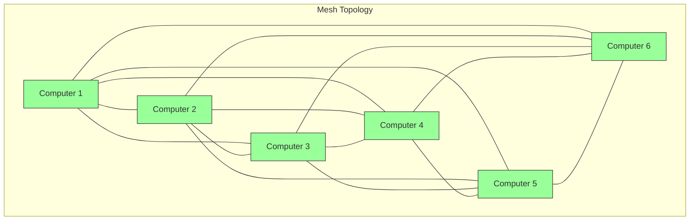

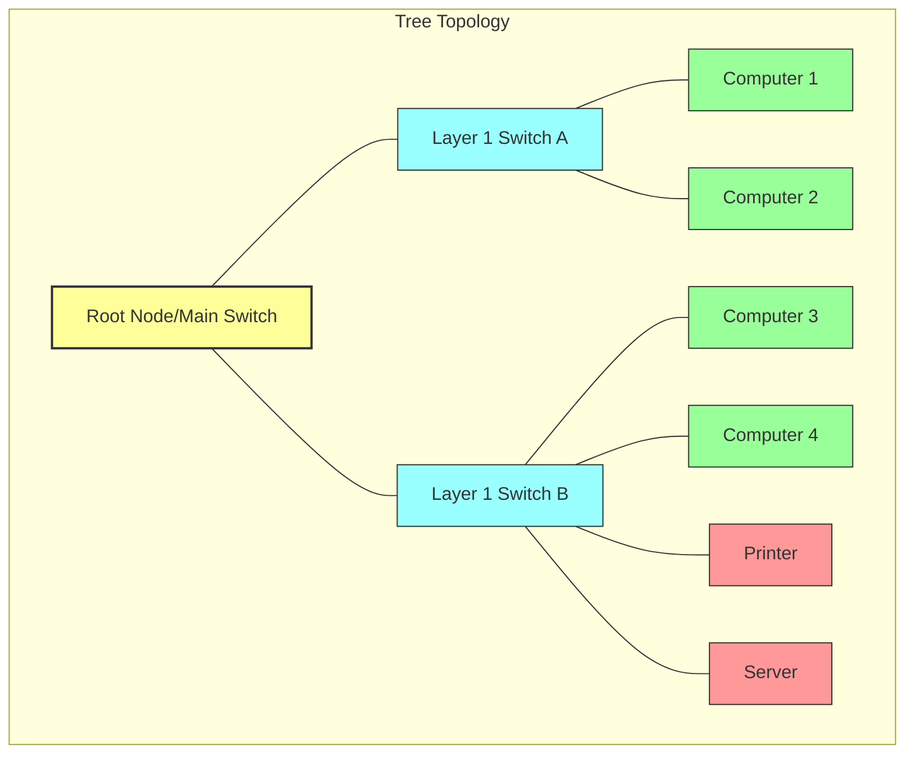
    

### Network Types

**Circuit-Switched Networks**
- Establishes a dedicated physical communication path before data exchange
- Reserves resources for the entire duration of the connection
- Examples: Traditional telephone networks
- Features:
    - Guaranteed bandwidth
    - Consistent performance
    - Inefficient use of resources during silence periods
    - Connection setup time before data transfer

**Packet-Switched Networks**
- Breaks messages into packets that can take different paths
- No dedicated path between devices
- Examples: The Internet, modern data networks
- Features:
    - Efficient use of network resources
    - Packets can take different routes to destination
    - No dedicated circuit required
    - More resilient to failures (redundancy)
    - Variable latency and performance

## Message Encoding and Communication

### Elements of Communication
- Source (sender)
- Destination (receiver)
- Channel (medium)
- Message (data)
- Protocol (rules)

### Key Terminology
- **Throughput**: Amount of data transmitted in a given time period
- **Goodput**: Amount of useful data (excluding overhead) transmitted in a given time
- **Bandwidth**: Maximum theoretical capacity of a medium
- **Latency**: Delay between sending and receiving data

### Message Encoding Process
1. **Encoding**: Converting information into a form suitable for transmission
2. **Transmission**: Sending the encoded message across the medium
3. **Decoding**: Converting received signals back into understandable form

### Message Formatting and Encapsulation
- **Encapsulation**: Process of adding headers and trailers as data moves down the protocol layers
- **De-encapsulation**: Process of removing headers and trailers as data moves up the protocol layers
- **Segmentation**: Dividing larger messages into smaller pieces for transmission

### Protocols
- A set of rules that determine how network devices communicate
- Define format, timing, sequencing, and error handling
- Organized into suites or stacks of related protocols

## The OSI Reference Model

### Overview
The Open Systems Interconnection (OSI) model is a conceptual framework that standardizes the functions of a communication system into seven distinct layers. Created by the International Standards Organization (ISO) in 1982.

### The Seven Layers (Top to Bottom)
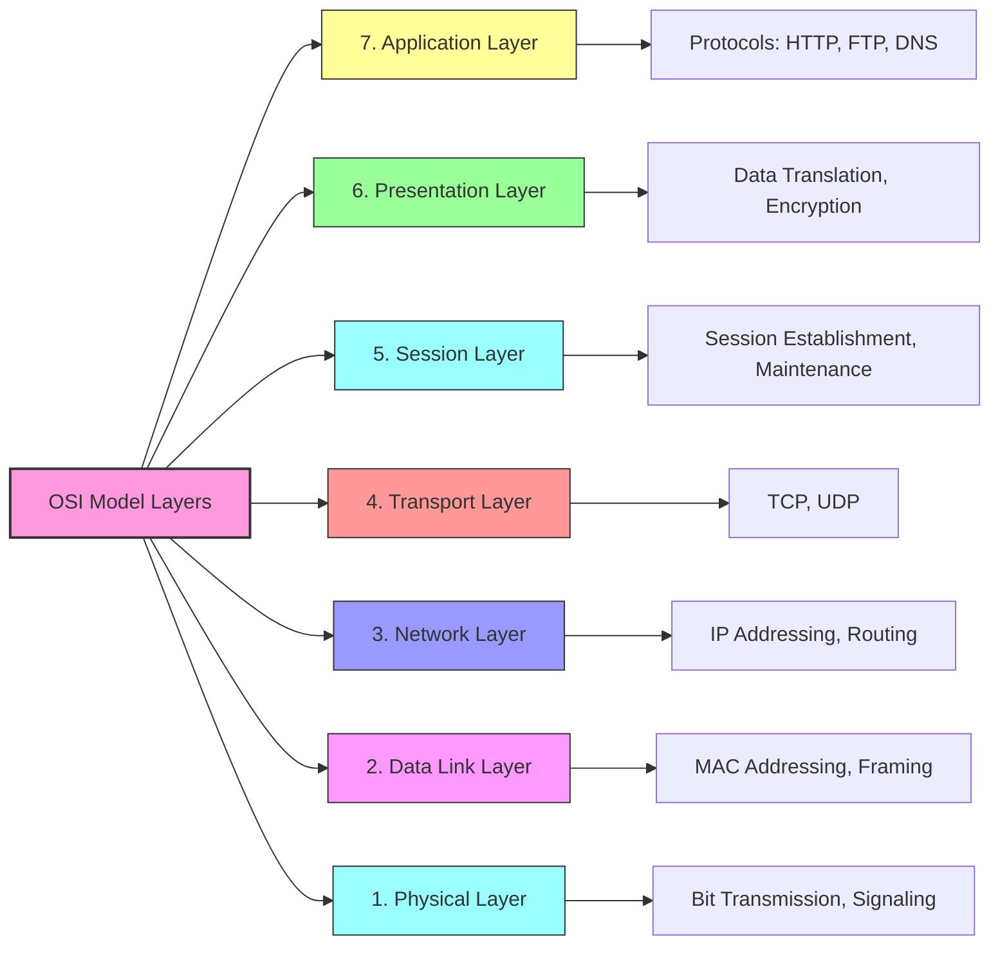

1. **Application** (Layer 7): Network services to applications
2. **Presentation** (Layer 6): Data translation and encryption
3. **Session** (Layer 5): Session establishment and management
4. **Transport** (Layer 4): End-to-end connections and reliability
5. **Network** (Layer 3): Logical addressing and routing
6. **Data Link** (Layer 2): Physical addressing and media access
7. **Physical** (Layer 1): Binary transmission and hardware

### Key Principles
- Each layer serves the layer above and is served by the layer below
- Changes in one layer don't affect other layers
- Each layer communicates with its counterpart on the receiving system

#### Application Layer (Layer 7)

##### Function
- Provides network services directly to end-user applications
- Closest layer to the end user
- Provides the interface between applications and the network

##### Key Protocols
- **HTTP/HTTPS**: Web browsing
- **FTP**: File Transfer Protocol
- **SMTP**: Email transmission
- **POP3/IMAP**: Email retrieval
- **DNS**: Domain Name resolution
- **Telnet/SSH**: Remote access
- **SNMP**: Network management

##### Important Concepts
- Application layer operates at both ends of the communication
- It is NOT the application itself, but the interface used by applications
- Determines resource availability and synchronizes communication

#### Presentation Layer (Layer 6)

##### Function
- Formats data for compatibility between different systems
- Handles data translation, compression, and encryption
- Ensures that the data from the Application layer can be understood by remote systems

##### Key Services
- **Data Translation**: Converts between different formats (e.g., ASCII to EBCDIC)
- **Data Compression**:
  - Lossless: Preserves all original data (e.g., ZIP)
  - Lossy: Approximation with some data loss (e.g., JPEG)
- **Encryption/Decryption**: Secures data for transmission (e.g., SSL/TLS)

##### Important Concepts
- Acts as the "translator" of the network
- Ensures independence between application processes and data representation details
- Frees the applications from concerns of data representation

#### Session Layer (Layer 5)

##### Function
- Establishes, maintains, and terminates connections (sessions) between applications
- Manages dialogue control and synchronization
- Provides checkpointing for long transfers

##### Key Services
- **Session Establishment**: Setting up communication
- **Session Maintenance**: Keeping track of which application's data is which
- **Session Termination**: Orderly shutdown of connections
- **Dialog Control**: Determining which side transmits and when
- **Synchronization**: Setting checkpoints for recovery

##### Examples in Practice
- NetBIOS and similar session services
- Remote Procedure Call (RPC) frameworks
- Authentication and authorization services
- Managing sessions for web pages with multiple elements

#### Transport Layer (Layer 4)

##### Function
- Provides end-to-end communication between applications
- Segments data for transmission and reassembles at destination
- Controls reliability, flow, and error recovery

##### Key Protocols

**TCP (Transmission Control Protocol)**
- Connection-oriented
- Reliable delivery through acknowledgments
- Flow control and congestion management
- In-order delivery
- Error detection and recovery
- Used for applications requiring reliability (web, email, file transfer)

**UDP (User Datagram Protocol)**
- Connectionless
- No guarantee of delivery
- No flow control or congestion management
- Minimal error checking without recovery
- Lower overhead, faster transmission
- Used for applications prioritizing speed over reliability (streaming, DNS, VoIP)

##### Key Concepts
- **Segmentation**: Dividing data into smaller units
- **Port Numbers**: Identifying specific applications (0-65535)
  - Well-known ports: 0-1023 (e.g., HTTP-80, HTTPS-443, FTP-21)
  - Registered ports: 1024-49151
  - Dynamic/private ports: 49152-65535
- **Sockets**: Combination of IP address and port number
- **Three-way Handshake** (TCP): SYN, SYN-ACK, ACK
- **Flow Control**: Preventing sender from overwhelming receiver
- **Error Control**: Detecting and retransmitting lost segments

#### Network Layer (Layer 3)

##### Function
- Routing and forwarding packets between different networks
- Logical addressing (IP addresses)
- Path determination (finding best route)
- Packet handling and fragmentation

##### Key Protocols
- **IPv4**: 32-bit addressing, limited address space
- **IPv6**: 128-bit addressing, vastly expanded address space
- **ICMP**: Internet Control Message Protocol, error reporting
- **OSPF**: Open Shortest Path First, interior routing protocol
- **BGP**: Border Gateway Protocol, exterior routing protocol

##### Key Concepts
- **Logical Addressing**: IP addresses identify networks and hosts
- **Routing**: Determining best path for data through multiple networks
- **Routers**: Layer 3 devices that connect networks and forward packets
- **Packet**: The Protocol Data Unit (PDU) at the Network layer
- **Fragmentation**: Breaking packets into smaller units to match network requirements
- **Time to Live (TTL)**: Preventing endless packet circulation

#### Data Link Layer (Layer 2)

##### Function
- Provides node-to-node connectivity and data transfer
- Physical addressing (MAC addresses)
- Access to the media
- Error detection for physical transmission
- Frame formatting

##### Sublayers
- **Logical Link Control (LLC)**: Interface with Network layer, service access points
- **Media Access Control (MAC)**: Addressing and media access methods

##### Media Access Control Methods
- **CSMA/CD** (Carrier Sense Multiple Access with Collision Detection)
  - Used in traditional Ethernet
  - Detects collisions after they occur
  - Device waits random time before retransmitting
- **CSMA/CA** (Carrier Sense Multiple Access with Collision Avoidance)
  - Used in wireless networks
  - Attempts to avoid collisions before they happen
  - Uses RTS/CTS (Request to Send/Clear to Send) mechanism
- **Token Passing**: Token circulates, only holder can transmit (used in Token Ring networks)

##### Key Concepts
- **MAC Address**: 48-bit physical address assigned to network interfaces
- **Frame**: The Protocol Data Unit (PDU) at the Data Link layer
- **Collision Domain**: Network segment where collisions can occur
- **Switches**: Layer 2 devices that forward frames based on MAC addresses
- **ARP**: Address Resolution Protocol, maps IP addresses to MAC addresses

#### Physical Layer (Layer 1)

##### Function
- Transmits raw bit stream over physical medium
- Defines electrical, mechanical, procedural specifications
- Converts digital data to appropriate signals for the medium

##### Key Specifications
- **Physical Characteristics**: Cables, connectors, pins, etc.
- **Voltage Levels**: Electrical signaling standards
- **Data Rates**: Bits per second transmission speed
- **Maximum Distances**: Cable length limitations
- **Physical Topology**: How devices are physically arranged

##### Transmission Media Types
- **Copper Cable**: Electrical signals (e.g., Ethernet)
- **Fiber Optic**: Light signals, higher bandwidth, immune to EMI
- **Wireless**: Radio waves (e.g., Wi-Fi, Bluetooth)

##### Important Concepts
- **Bandwidth**: Capacity of a medium to carry data
- **Throughput**: Actual data transfer rate achieved
- **Latency**: Delay in data transmission
- **Attenuation**: Signal loss over distance
- **Noise and Interference**: Signal degradation from external sources
- **Encoding Methods**: How bits are represented as signals

## The TCP/IP Model

### Overview
The Transmission Control Protocol/Internet Protocol (TCP/IP) model is the practical implementation used in real-world networking. It condenses the OSI model into four functional layers.

### The Four Layers (Top to Bottom)

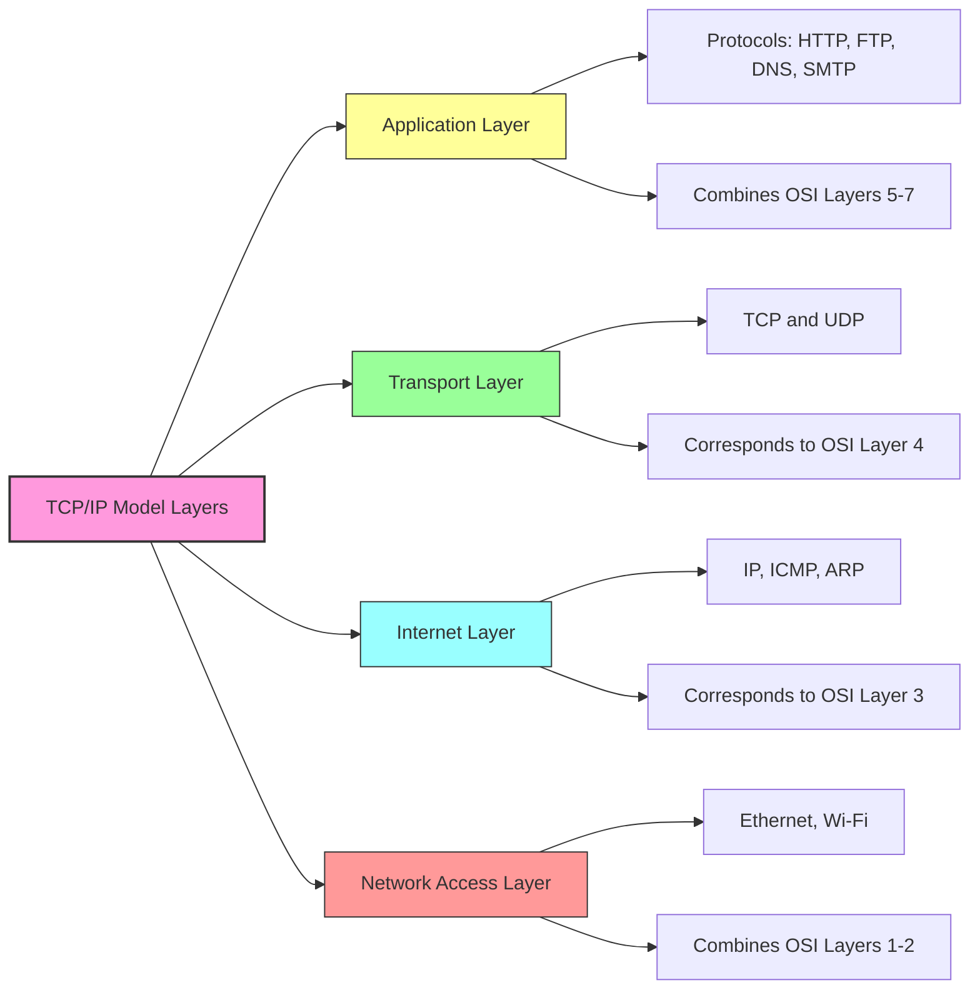

1. **Application**: Combines functions of OSI Application, Presentation, and Session layers
2. **Transport**: Corresponds to OSI Transport layer
3. **Internet**: Corresponds to OSI Network layer
4. **Network Access**: Combines OSI Data Link and Physical layers

### Comparison with OSI Model

| OSI Layer | TCP/IP Layer | Key Protocols |
|-----------|--------------|--------------|
| Application, Presentation, Session | Application | HTTP, FTP, DNS, SMTP, Telnet |
| Transport | Transport | TCP, UDP |
| Network | Internet | IP, ICMP, ARP |
| Data Link, Physical | Network Access | Ethernet, 802.11 (Wi-Fi) |

### Example Communication Flow

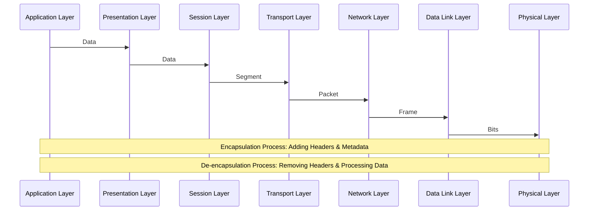

When a web client communicates with a web server:
1. User enters URL in browser (Application layer)
2. Browser formats request as HTTP (Application layer)
3. TCP breaks data into segments (Transport layer)
4. IP adds addressing information (Internet layer)
5. Ethernet formats data for transmission (Network Access layer)
6. Data is transmitted as electrical/light/radio signals
7. Process reverses at receiving end

## IP Addressing and Subnetting

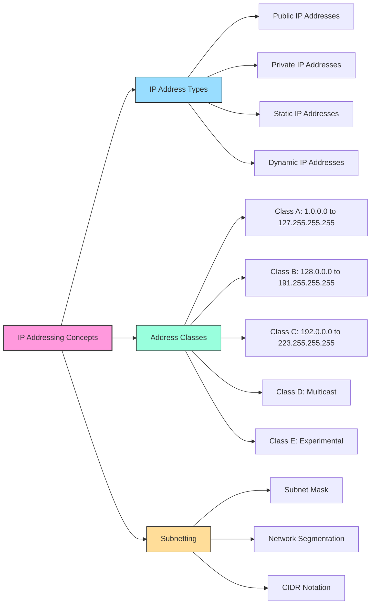

### IPv4 Addressing
- 32-bit addresses written in dotted decimal format (e.g., 192.168.1.1)
- Divided into network portion and host portion by subnet mask
- Total of approximately 4.3 billion possible addresses

### IPv4 Address Classes (Traditional)
- **Class A**: First bit is 0, 8-bit network, 24-bit host (1.0.0.0 to 127.255.255.255)
- **Class B**: First two bits are 10, 16-bit network, 16-bit host (128.0.0.0 to 191.255.255.255)
- **Class C**: First three bits are 110, 24-bit network, 8-bit host (192.0.0.0 to 223.255.255.255)
- **Class D**: Multicast addresses (224.0.0.0 to 239.255.255.255)
- **Class E**: Reserved (240.0.0.0 to 255.255.255.255)

### Subnetting
- Process of dividing a network into smaller subnets
- Subnet mask determines which portion is network vs. host
- Written in dotted decimal (255.255.255.0) or CIDR notation (/24)
- Allows more efficient use of address space
- Reduces broadcast domains
- Improves security through isolation

### IPv4 Address Types
- **Public IP**: Globally unique, routable on the internet
- **Private IP**: Used within private networks (not routable on internet)
    - 10.0.0.0 to 10.255.255.255 (10.0.0.0/8)
    - 172.16.0.0 to 172.31.255.255 (172.16.0.0/12)
    - 192.168.0.0 to 192.168.255.255 (192.168.0.0/16)
- **Static IP**: Manually assigned, fixed value
- **Dynamic IP**: Automatically assigned by DHCP

### IPv6 Addressing
- 128-bit addresses (8 groups of 4 hexadecimal digits)
- Example: 2001:0db8:85a3:0000:0000:8a2e:0370:7334
- Provides approximately 3.4 × 10^38 addresses
- Advantages over IPv4:
    - Vastly expanded address space
    - Simplified header format
    - Built-in security (IPsec)
    - Elimination of NAT requirement
    - Better support for auto-configuration

## Network Address Translation (NAT)

### Purpose and Function
- Allows multiple devices to share a single public IP address
- Translates private IP addresses to a public IP address for internet access
- Developed primarily to address IPv4 address exhaustion
- Provides incidental security benefits by hiding internal addresses

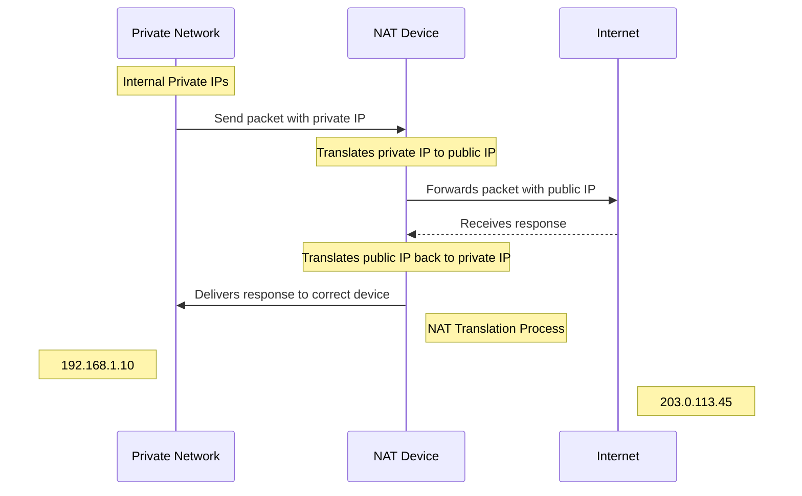

### Types of NAT
- **Static NAT**: One-to-one mapping between private and public addresses
- **Dynamic NAT**: Pool of public addresses shared among private addresses
- **Network Address Port Translation (NAPT)**: Multiple private addresses share a single public address through different port numbers

### Advantages
- Conserves public IP addresses
- Provides a level of security by hiding internal network structure
- Simplifies internal network addressing
- Allows connection of private networks to internet without renumbering

### Limitations
- Complicates peer-to-peer applications
- Breaks end-to-end connectivity
- Can introduce latency
- Requires translation of embedded IP addresses in some protocols
- Creates single point of failure

## Routing and Path Determination

### Routing Basics
- Process of determining best path for data through networks
- Performed by routers at the Network layer
- Uses logical addressing (IP) to make forwarding decisions
- Maintains routing tables of known networks and next hops

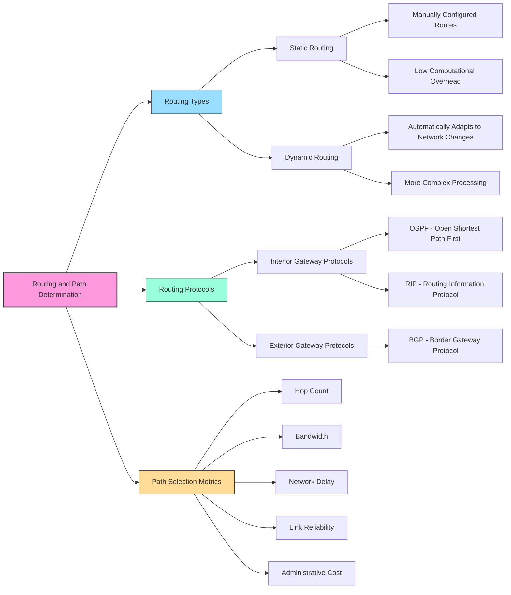

### Routing Methods
- **Static Routing**: Manually configured routes
    - Low overhead but doesn't adapt to changes
    - Good for small, stable networks
- **Dynamic Routing**: Automatic route discovery and adaptation
    - Adapts to network changes
    - Requires more CPU and bandwidth
    - Used in larger, more complex networks

### Routing Protocols
- **Interior Gateway Protocols** (within autonomous systems)
    - **OSPF (Open Shortest Path First)**: Link-state protocol using Dijkstra's algorithm
    - **RIP (Routing Information Protocol)**: Distance-vector protocol, simpler but less efficient
- **Exterior Gateway Protocols** (between autonomous systems)
    - **BGP (Border Gateway Protocol)**: Path-vector protocol used on the internet

### Path Determination
- Routers use metrics to determine best path
- Common metrics include:
    - Hop count (number of routers to cross)
    - Bandwidth (capacity of links)
    - Delay (time to reach destination)
    - Reliability (packet loss rate)
    - Cost (administrator-assigned value)

## Protocol Data Units (PDUs)

### Definition
Protocol Data Units (PDUs) are structured units of information transferred between network layers. Each layer has a specific name for its PDU.

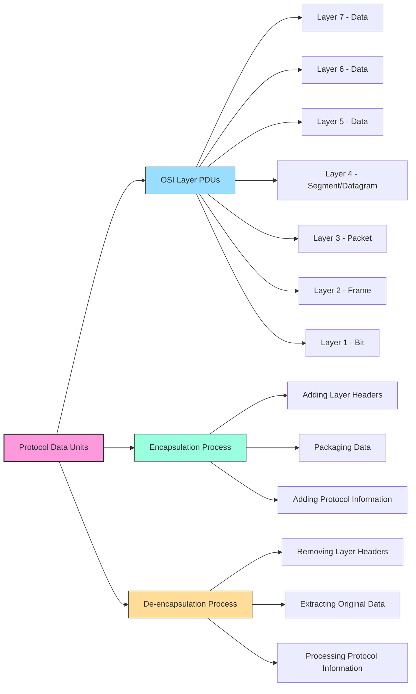
### PDUs by OSI Layer
- **Application, Presentation, Session Layers**: Data
- **Transport Layer**: Segment (TCP) or Datagram (UDP)
- **Network Layer**: Packet
- **Data Link Layer**: Frame
- **Physical Layer**: Bit

### Encapsulation Process
As data travels down the OSI model:
1. User data is generated at the Application layer
2. Transport layer adds header with port information → Segment
3. Network layer adds header with IP addresses → Packet
4. Data Link layer adds header with MAC addresses and trailer → Frame
5. Physical layer converts to bits for transmission

### De-encapsulation Process
As data travels up the OSI model at the receiver:
1. Physical layer converts signals to bits
2. Data Link layer processes the frame, removes header/trailer → Packet
3. Network layer processes the packet, removes header → Segment
4. Transport layer processes the segment, removes header → Data
5. Upper layers process the data for the application

## Information Security Principles

### The CIA Triad

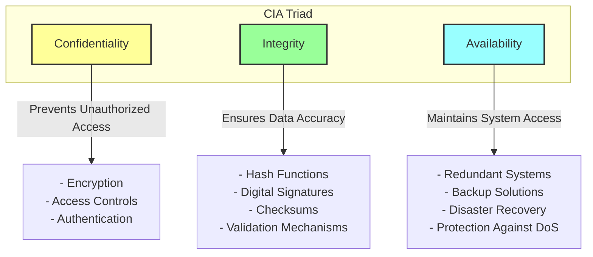
The cornerstone of information security consists of three principles:

**Confidentiality**
- Ensuring information is accessible only to authorized individuals
- Prevents unauthorized disclosure of sensitive information
- Implemented through:
    - Access controls
    - Encryption
    - Authentication mechanisms
    - Proper data classification

**Integrity**
- Ensuring data remains accurate and unaltered
- Prevents unauthorized modification of information
- Implemented through:
    - Hash functions
    - Digital signatures
    - Access controls
    - Data validation
    - Checksums

**Availability**
- Ensuring systems and data are accessible when needed
- Prevents disruption of service
- Implemented through:
    - Redundant systems
    - Backup solutions
    - Disaster recovery planning
    - High availability configurations
    - Protection against DoS attacks

### Additional Security Concepts
- **Authentication**: Verifying identities
- **Authorization**: Determining access rights
- **Accountability**: Tracking actions to individuals
- **Non-repudiation**: Preventing denial of having performed an action

## Cryptography Fundamentals

### Basic Concepts
- **Cryptography**: Science of secure communication
- **Encryption**: Converting plaintext to ciphertext
- **Decryption**: Converting ciphertext back to plaintext
- **Key**: Secret value used in encryption/decryption algorithms
- **Algorithm**: Mathematical function for encryption/decryption

### Types of Cryptography

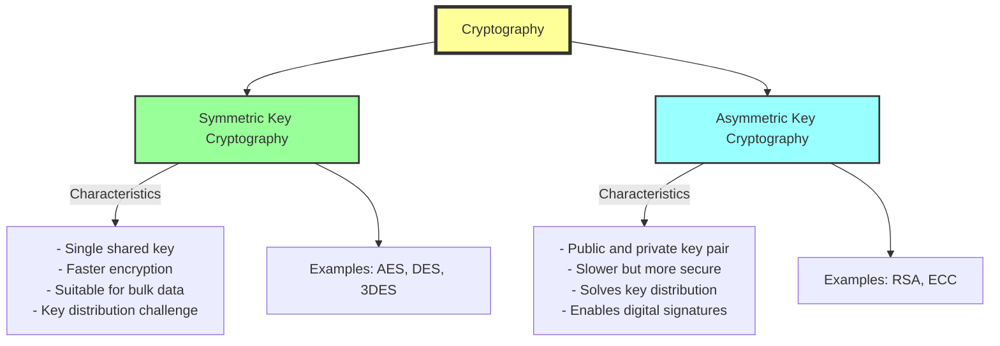

**Symmetric Key Cryptography**
- Uses same key for encryption and decryption
- Faster than asymmetric methods
- Suitable for bulk data encryption
- Examples: AES, DES, 3DES
- Main challenge: Secure key distribution

**Asymmetric Key Cryptography**
- Uses different keys for encryption and decryption (key pairs)
- Public key can be freely shared, private key kept secret
- Slower than symmetric methods
- Examples: RSA, ECC
- Solves key distribution problem
- Can provide digital signatures

### Key Exchange Methods
- **Diffie-Hellman**: Securely establishes shared key over insecure channel
- **RSA**: Can be used for key exchange using public-key cryptography
- **Out-of-band**: Using a separate secure channel to exchange keys

### Hash Functions
- One-way functions producing fixed-size output
- Used for data integrity verification
- Cannot be reversed to reveal original data
- Examples: MD5 (now considered insecure), SHA-256
- Applications:
    - Password storage
    - Digital signatures
    - Data integrity checking
    - Certificate validation

## Common Network Attacks and Countermeasures

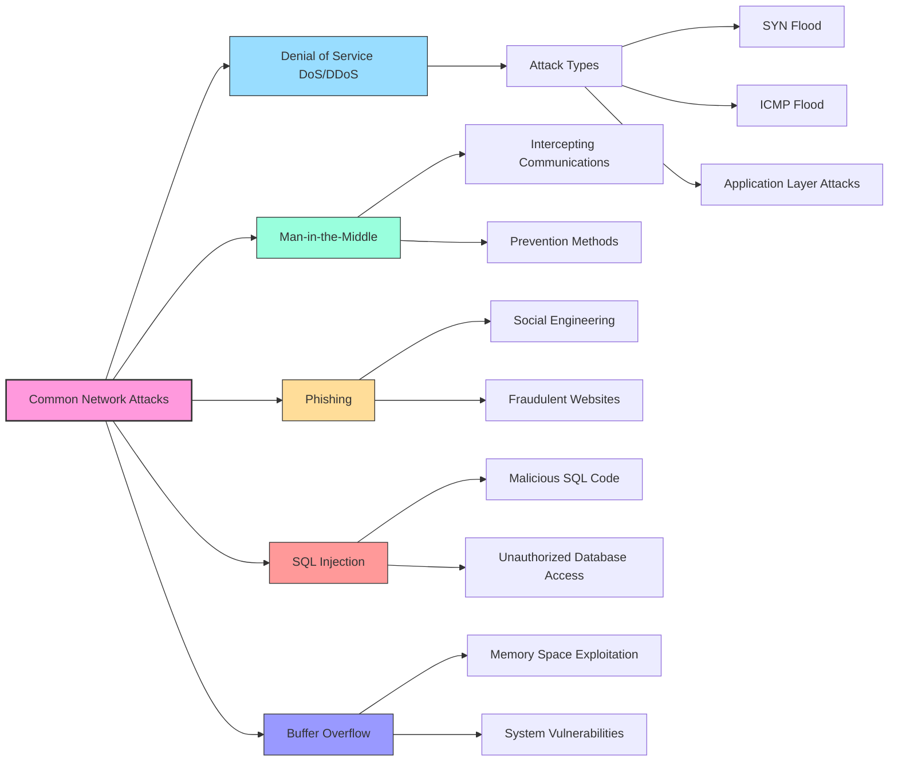

### Attack Types

**Denial of Service (DoS) and Distributed DoS (DDoS)**
- Flooding networks or services to make them unavailable
- Types include:
    - SYN floods
    - ICMP floods
    - Application layer attacks
- Countermeasures:
    - Firewalls with rate limiting
    - Traffic filtering
    - DDoS protection services
    - Redundant infrastructure

**Man-in-the-Middle Attacks**
- Intercepting communication between parties
- Countermeasures:
    - Encryption
    - Certificate validation
    - Secure protocols (HTTPS, SSH)

**Phishing**
- Social engineering to trick users into revealing information
- Countermeasures:
    - User education
    - Email filtering
    - Anti-phishing technologies
    - Multi-factor authentication

**SQL Injection**
- Inserting malicious SQL code into input fields
- Examples: ' OR '1'='1
- Countermeasures:
    - Input validation
    - Parameterized queries
    - Least privilege database accounts
    - Web application firewalls

**Buffer Overflow**
- Overwriting memory areas by exceeding buffer limits
- Countermeasures:
    - Input validation
    - Memory-safe programming languages
    - Address space layout randomization
    - Non-executable memory

**Cyberstalking**
- Online harassment using electronic communications
- Statistics:
    - 40% male victims, 60% female
    - 71% under 40
    - 70% of offenders known to victims
- Countermeasures:
    - Privacy settings
    - Anonymity tools
    - Spyware detection
    - Legal remedies

### Security Devices and Mechanisms

**Firewalls**
- Filter traffic based on security rules
- Can operate at different layers (packet, circuit, application)
- Block unauthorized access and malicious traffic

**Intrusion Detection/Prevention Systems**
- Monitor for suspicious activity or policy violations
- IDS alerts about threats, IPS actively blocks them

**Encryption Technologies**
- SSL/TLS for web traffic
- VPNs for secure remote access
- Full-disk encryption for data at rest

**Network Access Control**
- Restricts unauthorized users and devices
- Enforces security policies before allowing network access

## Network Troubleshooting

### Troubleshooting Methodology
1. Identify the problem
2. Establish a theory of probable cause
3. Test the theory
4. Establish a plan of action
5. Implement the solution
6. Verify system functionality
7. Document the solution

### Common Troubleshooting Tools

**ping**
- Tests basic connectivity to a host
- Measures round-trip time
- Uses ICMP Echo Request/Reply

**traceroute/tracert**
- Shows path packets take to destination
- Identifies where delays or failures occur
- Uses TTL expiration and ICMP messages

**ipconfig/ifconfig**
- Displays IP configuration information
- Shows IP address, subnet mask, gateway
- Useful for verifying addressing information

**nslookup/dig**
- Tests DNS name resolution
- Queries specific DNS servers
- Troubleshoots DNS issues

**netstat**
- Shows active network connections
- Displays listening ports
- Identifies established sessions

**Wireshark/packet analyzers**
- Captures and analyzes network traffic
- Deep packet inspection
- Troubleshoots complex protocol issues

### Common Network Issues
- IP addressing conflicts
- DNS resolution failures
- Default gateway issues
- DHCP service problems
- Physical connectivity failures
- Routing loops
- Network congestion
- Security constraints

## Key Terminology Glossary

**Bandwidth**: The maximum theoretical data transfer capacity of a network connection.

**Bridge**: A device that connects multiple network segments at the Data Link layer.

**Broadcast Domain**: A logical division of a computer network where all devices can receive broadcast frames from each other.

**CIDR (Classless Inter-Domain Routing)**: An IP addressing scheme that allows more flexible allocation of IP addresses than the traditional classful addressing.

**DHCP (Dynamic Host Configuration Protocol)**: Automatically assigns IP addresses and network configuration to devices.

**DNS (Domain Name System)**: Translates domain names to IP addresses.

**Encapsulation**: The process of adding headers and trailers as data passes down the protocol stack.

**Ethernet**: A widely used LAN technology defined by IEEE 802.3 standards.

**Firewall**: A network security device that monitors and filters traffic based on predefined rules.

**Gateway**: A device that connects different networks, typically operating at Layer 3.

**Hub**: A basic network device that connects multiple Ethernet devices together, creating a single collision domain.

**IP Address**: A numerical label assigned to each device on a network, used for identification and location addressing.

**Latency**: The time delay between the initiation and completion of a data transmission.

**MAC Address**: A unique identifier assigned to a network interface controller for communications at the Data Link layer.

**NAT (Network Address Translation)**: Technology that modifies network address information to map multiple private addresses to a single public address.

**OSI Model**: A conceptual framework that standardizes the functions of a telecommunication system into seven layers.

**Packet**: A formatted unit of data carried by a packet-switched network.

**Protocol**: A set of rules governing the exchange or transmission of data between devices.

**Router**: A network device that forwards data packets between computer networks, operating at Layer 3.

**Subnet Mask**: A 32-bit number that divides an IP address into network and host portions.

**Switch**: A network device that connects devices within a network by using packet switching to forward data to the destination device.

**TCP (Transmission Control Protocol)**: A connection-oriented protocol that provides reliable, ordered delivery of data.

**Throughput**: The actual amount of data successfully transferred through a network connection over a given time period.

**UDP (User Datagram Protocol)**: A connectionless protocol that provides faster but unreliable data delivery.

**VLAN (Virtual Local Area Network)**: A logical subdivision of a physical network at the Data Link layer.

**VPN (Virtual Private Network)**: Extends a private network across a public network, enabling secure data transmission.

**Wi-Fi**: A wireless networking technology based on the IEEE 802.11 standards.