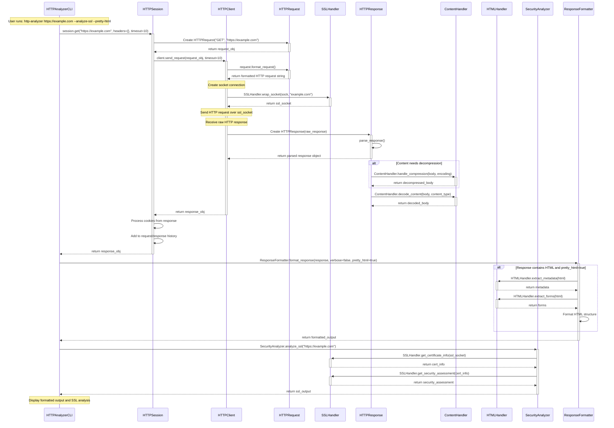

# HTTP Request Analyzer

A Python tool that sends, receives, and analyzes HTTP requests and responses, providing insight into the upper layers of the OSI model. This project demonstrates OSI Layers 5-7 (Session, Presentation, and Application) by implementing core HTTP client functionality from the ground up.

## Educational Purpose

This project is designed to help you understand the upper layers of the OSI model through practical implementation. By building this tool, you'll gain insights into:

- How HTTP works as an application-layer protocol (Layer 7)
- How data formatting, encryption, and encoding function in the presentation layer (Layer 6)
- How sessions are established, maintained, and terminated (Layer 5)
- The end-to-end process of web communication from client to server
- The relationship between HTTP and underlying transport protocols

## Network Concepts Demonstrated

### HTTPRequest and HTTPResponse Classes (Application Layer - Layer 7)
#### HTTP Protocol
HTTP (Hypertext Transfer Protocol) operates at the Application Layer (Layer 7) of the OSI model. The HTTPRequest and HTTPResponse classes implement the client side of this protocol.
HTTP follows a request-response pattern:

1. Client sends a request message
2. Server processes the request
3. Server returns a response message

An HTTP request consists of:

+ Request line (method, URL, version)
+ Headers (metadata about the request)
+ Optional body (data being sent)

An HTTP response contains:

+ Status line (version, status code, reason phrase)
+ Headers (metadata about the response)
+ Optional body (returned data)

According to the Mozilla Developer Network: "HTTP is a protocol for fetching resources such as HTML documents. It is the foundation of any data exchange on the Web and it is a client-server protocol, which means requests are initiated by the recipient, usually the Web browser."
Sources:

+ [RFC 7231: HTTP/1.1 Semantics and Content](https://tools.ietf.org/html/rfc7231)
+ [Mozilla HTTP Documentation](https://developer.mozilla.org/en-US/docs/Web/HTTP)

#### URL Parsing
URLs (Uniform Resource Locators) are a fundamental concept in web navigation. When the HTTPRequest class parses a URL, it's breaking down a structured address into components:
A URL typically contains:

+ Scheme (http, https)
+ Host (domain name or IP address)
+ Port (optional, defaults based on scheme)
+ Path (location on the server)
+ Query string (optional parameters)
+ Fragment (optional bookmark within the resource)

According to RFC 3986: "A URI is a compact sequence of characters that identifies an abstract or physical resource," and URLs are a subset of URIs that provide a means of locating the resource by describing its primary access mechanism.
Sources:

+ [RFC 3986: Uniform Resource Identifier (URI): Generic Syntax](https://tools.ietf.org/html/rfc3986)
+ Berners-Lee, T., Fielding, R., & Masinter, L. (2005). Uniform Resource Identifier (URI): Generic Syntax. Internet Engineering Task Force.

### ContentHandler Class (Presentation Layer - Layer 6)
#### Data Format Conversion
The Presentation Layer is responsible for data translation, encryption, and formatting. The ContentHandler class exemplifies this by transforming data between different formats:

1. JSON (JavaScript Object Notation): A lightweight data interchange format that is easy for humans to read and write and easy for machines to parse and generate. The decode_json method converts JSON-formatted strings into Python objects.
2. Form Data: Web forms typically submit data in application/x-www-form-urlencoded format, which the decode_form_data method handles. This format uses key-value pairs separated by '&' with keys and values URL-encoded.
3. Multipart Form Data: Used for file uploads and forms with binary data, multipart/form-data uses boundary strings to separate different parts of the data. The decode_multipart method parses this complex format.

According to the W3C: "The Presentation layer is concerned with preserving the meaning of information sent across a network. The Presentation layer may represent (encode) the data in various ways (e.g., data compression or encryption)."
Sources:

+ [RFC 8259: The JavaScript Object Notation (JSON) Data Interchange Format](https://tools.ietf.org/html/rfc8259)
+ [RFC 7578: Returning Values from Forms: multipart/form-data](https://tools.ietf.org/html/rfc7578)
+ Ecma International. (2017). ECMA-404: The JSON Data Interchange Syntax (2nd ed.).

#### Character Encoding and Decoding
Character encoding is a crucial concept in network communication. It defines how characters are converted into bytes for transmission and storage.
Common character encodings include:

+ UTF-8: A variable-width encoding that can represent every character in the Unicode standard, yet remains backward compatible with ASCII.
+ ISO-8859-1 (Latin-1): A single-byte encoding that covers most Western European languages.
+ UTF-16: Uses either one or two 16-bit code units per character.

The ContentHandler methods need to handle encoding detection and conversion, especially when the Content-Type header specifies a charset parameter. For example, "text/html; charset=utf-8" indicates that the content uses UTF-8 encoding.
Joel Spolsky, in his famous article "The Absolute Minimum Every Software Developer Absolutely, Positively Must Know About Unicode and Character Sets," states: "It does not make sense to have a string without knowing what encoding it uses. You can no longer stick your head in the sand and pretend that 'plain' text is ASCII."
Sources:

+ The Unicode Consortium. (2019). The Unicode Standard, Version 12.0.0. Mountain View, CA: The Unicode Consortium.
+ [Joel Spolsky on Unicode](https://www.joelonsoftware.com/2003/10/08/the-absolute-minimum-every-software-developer-absolutely-positively-must-know-about-unicode-and-character-sets-no-excuses/)
+ [RFC 3629: UTF-8, a transformation format of ISO 10646](https://tools.ietf.org/html/rfc3629)

#### Compression and Decompression
HTTP supports content compression to reduce transmission size and improve loading times. The ContentHandler.handle_compression method needs to handle various compression algorithms:

1. gzip: Based on the DEFLATE algorithm, it's widely supported and offers good compression ratios for text-based content.
2. deflate: The raw DEFLATE compressed data format, which combines LZ77 and Huffman coding.
3. br (Brotli): A newer compression algorithm developed by Google that offers better compression ratios than gzip, especially for text content.

Compression works at the Presentation Layer because it transforms data representation without changing its semantic meaning. The server compresses the response body and adds a Content-Encoding header to indicate the compression method. The client then decompresses the content before processing it.
According to Google Developers: "Minifying and compressing network payloads is an important design optimization that can significantly reduce the amount of time it takes to download resources, reduce a website's bandwidth consumption, and improve the user experience."
Sources:

+ [RFC 1952: GZIP file format specification version 4.3](https://tools.ietf.org/html/rfc1952)
+ [RFC 1951: DEFLATE Compressed Data Format Specification](https://tools.ietf.org/html/rfc1951)
+ [RFC 7932: Brotli Compressed Data Format](https://tools.ietf.org/html/rfc7932)
+ [Web Fundamentals: Optimizing Encoding and Transfer Size](https://developers.google.com/web/fundamentals/performance/optimizing-content-efficiency/optimize-encoding-and-transfer)

#### MIME Types
MIME (Multipurpose Internet Mail Extensions) types identify the format of a document transmitted over the Internet. The ContentHandler uses MIME types (specified in Content-Type headers) to determine how to process data.
Common MIME types include:

+ `text/html`: HTML documents
+ `text/plain`: Plain text
+ `application/json`: JSON data
+ `image/jpeg`: JPEG images
+ `application/octet-stream`: Binary data

The Internet Assigned Numbers Authority (IANA) maintains the official registry of MIME types. According to the Mozilla Developer Network: "MIME types (now properly called 'media types', but also sometimes 'content types') are a way to label file formats on the Internet."
When a browser receives a resource, it uses the MIME type to determine how to process or display it, regardless of the file extension. Similarly, the ContentHandler needs to process content differently based on its MIME type.
Sources:

+ [RFC 6838: Media Type Specifications and Registration Procedures](https://tools.ietf.org/html/rfc6838)
+ [IANA Media Types Registry](https://www.iana.org/assignments/media-types/media-types.xhtml)
+ [Mozilla MIME Types Documentation](https://developer.mozilla.org/en-US/docs/Web/HTTP/Basics_of_HTTP/MIME_types)

### SSLHandler Class (Presentation Layer - Layer 6)
#### SSL/TLS Encryption
Secure Sockets Layer (SSL) and its successor Transport Layer Security (TLS) provide encryption, authentication, and integrity for HTTP communications. The SSLHandler class implements these security aspects of the Presentation Layer.
Despite the name "Secure Sockets Layer," which suggests the Transport Layer, SSL/TLS actually functions at the Presentation Layer because it transforms data representation (through encryption) without changing the underlying communication protocol.
The TLS handshake process involves:

1. Client and server agree on protocol version and cipher suite
2. Server authentication (and optionally client authentication) via certificates
3. Key exchange for establishing session keys
4. Encryption of subsequent communication

According to the Internet Engineering Task Force (IETF): "The primary goal of the TLS protocol is to provide privacy and data integrity between two communicating applications."
Sources:

+ [RFC 8446: The Transport Layer Security (TLS) Protocol Version 1.3](https://tools.ietf.org/html/rfc8446)
+ [RFC 5246: The Transport Layer Security (TLS) Protocol Version 1.2](https://tools.ietf.org/html/rfc5246)
+ Thomas, S. A. (2000). SSL and TLS essentials: Securing the Web. John Wiley & Sons.

#### Certificate Validation
Digital certificates are fundamental to the security of HTTPS connections. The SSLHandler.get_certificate_info method extracts and analyzes certificate information, which includes:

1. Certificate Authority (CA): The trusted entity that issued the certificate
2. Subject: Information about the certificate owner (domain name, organization)
3. Validity Period: Start and end dates for certificate validity
4. Public Key: Used for encryption and signature verification
5. Digital Signature: Ensures certificate integrity

Certificate validation involves several checks:

+ Verifying the certificate is signed by a trusted CA
+ Checking the certificate hasn't expired
+ Confirming the certificate is issued for the domain being accessed
+ Verifying the certificate hasn't been revoked

According to the Mozilla Web Security Guidelines: "Certificate validation is the process of ensuring a certificate is valid, trusted, and not forged or expired. This is a critical step in establishing a secure TLS connection."
Sources:

+ [RFC 5280: Internet X.509 Public Key Infrastructure Certificate and CRL Profile](https://tools.ietf.org/html/rfc5280)
+ Rescorla, E. (2001). SSL and TLS: Designing and Building Secure Systems. Addison-Wesley.
+ [Mozilla Web Security](https://infosec.mozilla.org/guidelines/web_security)

#### Security Assessment
The `SSLHandler.get_security_assessment` method evaluates the security of an SSL/TLS connection by examining:

1. Protocol Version: More recent versions (TLS 1.2, TLS 1.3) are more secure than older versions (SSL 3.0, TLS 1.0), which have known vulnerabilities.
2. Cipher Suite: The combination of cryptographic algorithms used for the connection. Stronger ciphers provide better security.
3. Certificate Strength: The key length and signature algorithm of the certificate affect its resistance to attacks.
4. Certificate Trust: Whether the certificate is trusted by default or requires additional validation.

The OWASP Foundation advises: "Always use TLS (instead of SSL), use strong algorithms, and disable previous versions that are considered insecure. Currently TLS 1.2/1.3 is recommended for secure communications."
Sources:

+ [OWASP Transport Layer Protection Cheat Sheet](https://cheatsheetseries.owasp.org/cheatsheets/Transport_Layer_Protection_Cheat_Sheet.html)
+ [Qualys SSL Labs Server Rating Guide](https://github.com/ssllabs/research/wiki/SSL-Server-Rating-Guide)
+ Bhargavan, K., Lavaud, A. D., Fournet, C., Pironti, A., & Strub, P. Y. (2014). Triple handshakes and cookie cutters: Breaking and fixing authentication over TLS. In 2014 IEEE Symposium on Security and Privacy.

### HTTPClient Class (Session Layer - Layer 5)
Connection Establishment
At the Session Layer (Layer 5), the HTTPClient establishes and maintains connections between applications. HTTP connections traditionally followed a pattern where each request required a new TCP connection. Modern HTTP (HTTP/1.1+) introduced persistent connections, allowing multiple requests to use the same connection.
When the client creates a socket connection to a server, it's implementing a fundamental Session Layer function. The code sets up communication parameters (like timeouts) and handles the dialog coordination between client and server applications.
The Session Layer is responsible for:

+ Setting up connections between applications
+ Maintaining those connections during data exchange
+ Properly terminating connections
+ Synchronizing data flow with checkpoints

According to Andrew S. Tanenbaum in "Computer Networks" (5th edition): "The session layer allows users on different machines to establish sessions between them. Sessions offer various services, including dialog control (keeping track of whose turn it is to transmit), token management (preventing two parties from attempting the same critical operation simultaneously), and synchronization (checkpointing long transfers to allow them to continue from where they left off after a crash)."
Sources:

+ [RFC 7230: HTTP/1.1 Message Syntax and Routing](https://tools.ietf.org/html/rfc7230)
+ Kurose, J. F., & Ross, K. W. (2017). Computer Networking: A Top-Down Approach (7th ed.). Pearson.

#### Socket Communication
Socket programming is how the HTTPClient will communicate over the network. A socket is an endpoint for sending and receiving data across a network. In Python, the socket module provides a low-level networking interface.
When the client code creates a socket:

```python
sock = socket.socket(socket.AF_INET, socket.SOCK_STREAM)
```

You're specifying:

+ `AF_INET`: Using IPv4 addressing (Layer 3 - Network)
+ `SOCK_STREAM`: Using TCP (Layer 4 - Transport)

Then, when connecting to a server:

```python
sock.connect((host, port))
```
You're establishing a TCP connection at the Transport Layer that will be used by the Session Layer logic to maintain application dialog.
Sources:

+ Stevens, W. R., Fenner, B., & Rudoff, A. M. (2003). UNIX Network Programming: The Sockets Networking API (Vol. 1, 3rd ed.). Addison-Wesley Professional.
+ [Python Socket Documentation](https://docs.python.org/3/library/socket.html)


### HTTPSession Class (Session Layer - Layer 5)
#### Session Management
HTTP is fundamentally a stateless protocol, but web applications often need to maintain state across multiple requests. This state management happens at the Session Layer. The HTTPSession class implements this through techniques like:

1. Cookie Management: Cookies are small pieces of data stored by the client and sent with each request to the same server. They enable the server to recognize clients across multiple requests.
2. Authentication Persistence: Maintaining authentication credentials (like OAuth tokens or session IDs) across requests.

The W3C explains: "An HTTP cookie (web cookie, browser cookie) is a small piece of data that a server sends to a user's web browser. The browser may store the cookie and send it back to the same server with later requests. Typically, an HTTP cookie is used to tell if two requests come from the same browser—keeping a user logged in, for example."
Session state can be maintained in various ways:

+ Client-side (cookies)
+ Server-side (sessions with client-side session IDs)
+ URL parameters (less common now due to security concerns)

Sources:

+ [RFC 6265: HTTP State Management Mechanism](https://tools.ietf.org/html/rfc6265)
+ Fielding, R. T., & Taylor, R. N. (2002). Principled design of the modern Web architecture. ACM Transactions on Internet Technology, 2(2), 115-150.

#### Integration of OSI Layers in HTTP Communication
The HTTP Request Analyzer demonstrates how the upper OSI layers work together in web communication:

1. Application Layer (Layer 7):

   + HTTP protocol semantics (methods, status codes)
   + Request and response structure
   + Application-specific headers and content

2. Presentation Layer (Layer 6):

   + Data format translation (JSON, form data)
   + Character encoding/decoding
   + Compression/decompression
   + Encryption/decryption (SSL/TLS)

3. Session Layer (Layer 5):

   + Connection establishment and maintenance
   + Session tracking (cookies)
   + Dialog coordination between client and server


In practice, these layers are not strictly isolated but often overlap in implementation. For example, HTTP cookies (conceptually Session Layer) are implemented through HTTP headers (Application Layer), and SSL/TLS (Presentation Layer) works closely with TCP (Transport Layer) connections.
Andrew S. Tanenbaum explains: "Although the OSI model is widely referenced, the Internet does not follow the model exactly. The Internet has no session or presentation layers. Instead, applications must include any session and presentation functionality."
Sources:

+ Tanenbaum, A. S., & Wetherall, D. J. (2011). Computer Networks (5th ed.). Prentice Hall.
+ Comer, D. (2014). Internetworking with TCP/IP: Principles, Protocols, and Architecture (6th ed.). Pearson.
+ Fall, K. R., & Stevens, W. R. (2011). TCP/IP Illustrated, Volume 1: The Protocols (2nd ed.). Addison-Wesley Professional.

## Project Structure

```
http_analyzer/
├── __init__.py
├── __main__.py             # Application entry point
├── cli.py                  # Command-line interface
├── client.py               # Low-level HTTP communication
├── content.py              # Content handling and processing
├── formatters/             # Response formatting utilities
│   ├── html_formatter.py
│   ├── json_formatter.py
│   └── terminal_colors.py
├── html_fallback_parser.py # Fallback HTML parsing
├── html_handler.py         # HTML content parsing
├── request.py              # HTTP request construction
├── response.py             # HTTP response parsing
├── security/               # Security analysis
│   └── security_analyzer.py
├── session.py              # Session management
└── ssl_handler.py          # SSL/TLS handling

tests/
└── http_analyzer/          # Corresponding test files
```

## Setup and Installation

This project uses a virtual environment to manage dependencies. See README in main repository.

### Prerequisites
- Python 3.6+
- Basic understanding of HTTP concepts

## Core Components

The project is organized around several key components that mirror the structure of HTTP communication:

1. **HTTPClient (`client.py`)**
   - Handles low-level socket communication
   - Manages connection establishment and request sending
   - Supports both HTTP and HTTPS
   - Implements connection reuse and timeout handling

2. **HTTPRequest (`request.py`)**
   - Constructs HTTP requests
   - Parses and formats URLs
   - Manages request headers and bodies
   - Supports various HTTP methods (GET, POST)

3. **HTTPResponse (`response.py`)**
   - Parses raw HTTP response data
   - Extracts status codes, headers, and body
   - Provides content decoding
   - Handles different content types

4. **HTTPSession (`session.py`)**
   - Manages session-level HTTP interactions
   - Tracks cookies across requests
   - Maintains request history
   - Handles authentication and state preservation

### Specialized Handlers

1. **ContentHandler (`content.py`)**
   - Transforms data between different formats
   - Handles JSON, form data, and text processing
   - Manages character encoding
   - Implements compression handling

2. **SSLHandler (`ssl_handler.py`)**
   - Manages SSL/TLS encryption
   - Performs certificate validation
   - Provides security assessments
   - Handles TLS connection details

3. **HTMLHandler (`html_handler.py`)**
   - Parses HTML content
   - Extracts metadata
   - Supports fallback parsing when BeautifulSoup is unavailable

### Formatters and Utilities

1. **CLI Interface (`cli.py`)**
   - Provides command-line argument parsing
   - Manages request execution
   - Handles output formatting

2. **Response Formatters**
   - HTML formatting
   - JSON syntax highlighting
   - Terminal color support

## Usage

As an example, the sequence diagram below illustrates the flow of data through the HTTP Analyzer when 
executing the command `http-analyzer https://example.com --analyze-ssl --pretty-html`:



### Command-line Arguments
```
HTTP Request Analyzer - Explore Network Protocols

positional arguments:
  url                   URL to send request to

options:
  -h, --help            show this help message and exit
  -m {GET,POST}, --method {GET,POST}
                        HTTP method to use (default: GET)
  -f, --follow-redirects
                        Follow HTTP redirects
  -v, --verbose         Show detailed output
  -d DATA, --data DATA  Request body data for POST/PUT requests
  -j JSON, --json JSON  JSON data to send with request
  -H HEADER, --header HEADER
                        Custom HTTP headers (can be used multiple times)
  -o OUTPUT, --output OUTPUT
                        Save response body to a file
  -t TIMEOUT, --timeout TIMEOUT
                        Request timeout in seconds (default: 10)
  --analyze-ssl         Perform SSL/TLS security analysis for HTTPS
  --pretty-html         Format HTML responses for better readability
  --no-color            Disable colored output
```

## Learning Outcomes

After completing this project, you should be able to:

1. Explain the HTTP request-response cycle in detail
2. Understand how sessions are maintained on the stateless HTTP protocol
3. Describe the role of various HTTP headers and status codes
4. Explain how HTTPS encrypts communication
5. Understand content negotiation and representation
6. Analyze web application behavior through HTTP traffic
7. Explain how cookies and other session mechanisms work

## Future Enhancements

To extend this project and deepen your understanding, consider adding:

1. WebSocket protocol support for persistent connections
2. HTTP/2 protocol features
3. Authentication mechanisms (Basic, OAuth, etc.)
4. Advanced content analysis for HTML, JSON, and XML
5. Performance benchmarking for different request types
6. API testing capabilities
7. Proxy server support

## Security and Ethical Considerations

This tool should be used responsibly. While it's designed for educational purposes, it could potentially be used for web scraping or testing. Always:

- Respect robots.txt files and site terms of service
- Avoid overwhelming servers with too many requests
- Do not use for penetration testing without explicit permission
- Be careful with sensitive data in your requests and responses

## License

MIT.