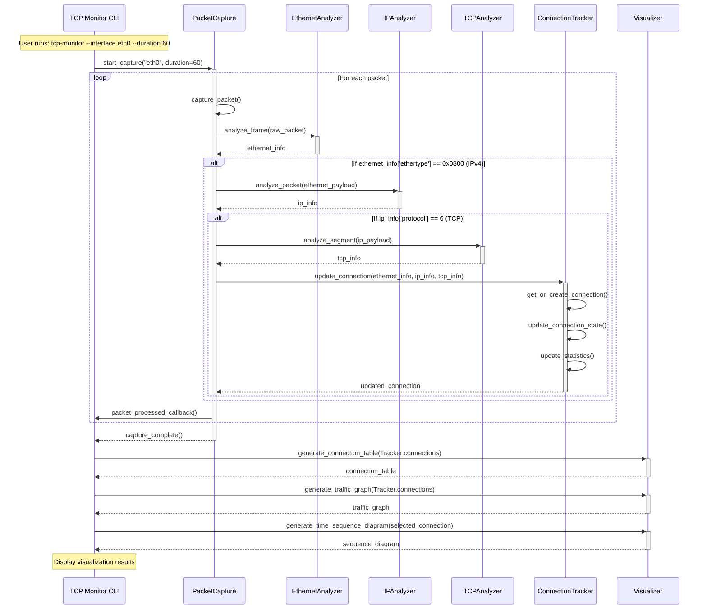

# TCP Connection Monitor

A Python tool that captures, analyzes, and visualizes TCP connection data, providing insight into the lower layers of the OSI model. This project demonstrates OSI Layers 1-4 (Physical, Data Link, Network, and Transport) by implementing a packet capture and analysis system from the ground up.

## Educational Purpose

This project is designed to help you understand the lower layers of the OSI model through practical implementation. By building this tool, you'll gain insights into:

- How network interfaces function at the Physical layer (Layer 1)
- How frames are processed at the Data Link layer (Layer 2)
- How IP routing works at the Network layer (Layer 3)
- How TCP connections operate at the Transport layer (Layer 4)
- The end-to-end process of establishing, maintaining, and terminating TCP connections
- The relationship between TCP and underlying network protocols

## Network Concepts Demonstrated

### Packet Capture (Physical Layer - Layer 1)

#### Network Interface Access
The physical layer defines the electrical, mechanical, and functional specifications for activating and maintaining the physical link between systems. In our TCP Monitor tool, this layer is represented by direct access to network interfaces:

```python
# Example of accessing network interface
packet_capture = PacketCapture()
interface = packet_capture.interface
```

When the tool captures packets directly from a network interface, it's interacting with the physical layer where raw bits are transmitted and received. According to the IEEE 802 standards, the physical layer "defines the means of transmitting raw bits rather than logical data packets over a physical link connecting network nodes."

The physical layer is responsible for:
- Bit-level transmission
- Hardware specifications
- Signal characteristics
- Data encoding
- Physical network topologies

Sources:
- IEEE Standards Association. (2017). IEEE Standard for Ethernet. IEEE Std 802.3-2018.
- Stallings, W. (2016). Data and Computer Communications (10th ed.). Pearson.

### Frame Analysis (Data Link Layer - Layer 2)

#### Ethernet Frames
The Data Link layer provides node-to-node data transfer across a physical network. It handles framing, addressing using MAC addresses, and error detection. In the TCP Monitor, we analyze Ethernet frames:

```python
def analyze_frame(frame_data):
   # Check if the frame is too short
   if len(frame) < 14:
      return {'error': 'Frame too short to be a valid Ethernet frame'}

   # Get both header and payload information
   header_info = EthernetAnalyzer.analyze_ethernet_header(frame)
   payload_info = EthernetAnalyzer.analyze_ethernet_payload(frame)

   return {**header_info, **payload_info}

def analyze_ethernet_header(frame: bytes) -> dict:
   dst_mac = EthernetAnalyzer.format_mac_address(frame[0:6])
   is_broadcast = False
   is_multicast = False
   if dst_mac == 'ff:ff:ff:ff:ff:ff':
      is_broadcast = True
   # Multicast destination MAC (first byte has least significant bit set)
   elif dst_mac[0:2] == '01':
      is_multicast = True
   src_mac = EthernetAnalyzer.format_mac_address(frame[6:12])
   ethertype = (frame[12] << 8) + frame[13]
   ethertype_name = EthernetAnalyzer.get_ethertype_name(ethertype)

   is_vlan_tagged = False
   vlan_id = None
   inner_ethertype = None
   inner_ethertype_name = ''
   if ethertype ==  0x8100:
      is_vlan_tagged = True
      vlan_id = (frame[14] << 8) + frame[15]
      inner_ethertype = (frame[16] << 8) + frame[17]
      inner_ethertype_name = EthernetAnalyzer.get_ethertype_name(inner_ethertype)

   return {'dst_mac': dst_mac,
           'is_broadcast': is_broadcast,
           'is_multicast': is_multicast,
           'src_mac': src_mac,
           'ethertype': ethertype,
           'ethertype_name': ethertype_name,
           'is_vlan_tagged': is_vlan_tagged,
           'vlan_id': vlan_id,
           'inner_ethertype': inner_ethertype,
           'inner_ethertype_name': inner_ethertype_name}

def analyze_ethernet_payload(frame: bytes) -> dict:
   payload = frame[14:]
   payload_size = len(payload)
   return {'payload': payload, 'payload_size': payload_size}
```

Ethernet is the most common Data Link layer protocol. An Ethernet frame consists of:
- Preamble and Start Frame Delimiter (often handled by hardware)
- Destination MAC address (6 bytes)
- Source MAC address (6 bytes)
- EtherType/Length field (2 bytes)
- Payload data
- Frame Check Sequence (4 bytes)

According to the IEEE: "The data link layer provides for the transfer of data between network entities and the detection and possible correction of errors that may occur in the physical layer."

Sources:
- [IEEE 802.3-2018: IEEE Standard for Ethernet](https://ieeexplore.ieee.org/document/8457469)
- Kurose, J. F., & Ross, K. W. (2017). Computer Networking: A Top-Down Approach (7th ed.). Pearson.

#### MAC Addressing
Media Access Control (MAC) addressing is a crucial concept at the Data Link layer:

```python
def format_mac_address(mac):
   return ':'.join(mac.hex()[i:i+2] for i in range(0,12,2))
```

MAC addresses are 48-bit (6-byte) identifiers assigned to network interfaces for communications at the data link layer. They are unique identifiers assigned to devices by manufacturers and are used for local network communications.

Unlike IP addresses which can change, MAC addresses are typically fixed and "burned in" to the network interface card. According to Cisco documentation: "MAC addresses function at the data link layer (Layer 2) of the OSI reference model and enable devices to communicate at the data link level."

Sources:
- Cisco Networking Academy. (2014). Introduction to Networks Companion Guide. Cisco Press.
- IEEE Standards Association. (2017). Guidelines for 48-bit Global Identifier (EUI-48). IEEE.

### IP Packet Analysis (Network Layer - Layer 3)

#### IP Headers
The Network layer provides routing and addressing functions, allowing data to be transferred across network boundaries. IP (Internet Protocol) is the primary protocol at this layer:

```python
def analyze_packet(ip_packet):
   # Extract 1st byte of packet header
   # Shift the value right by 4 bits, extracting the first 4 bits of the byte
   ip_results = {}
   if len(ip_packet) < 20:
      ip_results['error'] = "IP packet too short to contain a valid header."
      return ip_results
   else:
      version = ip_packet[0] >> 4
      if version == 4:
         ip_results = IPAnalyzer.analyze_ipv4_packet_header(ip_packet)
      elif version == 6:
         ip_results = IPAnalyzer.analyze_ipv6_packet_header(ip_packet)
      else:
         ip_results['error'] = f"Invalid IP version: {version}. Only IPv4 and IPv6 are supported."
         return ip_results

      ip_results['version'] = version
      return IPAnalyzer.analyze_packet_payload(ip_packet, ip_results)
```

An IPv4 header includes:
- Version (4 bits)
- Internet Header Length (IHL) (4 bits)
- Type of Service/DSCP (8 bits)
- Total Length (16 bits)
- Identification (16 bits)
- Flags and Fragment Offset (16 bits)
- Time to Live (TTL) (8 bits)
- Protocol (8 bits)
- Header Checksum (16 bits)
- Source IP Address (32 bits)
- Destination IP Address (32 bits)
- Options (if present)

The Internet Protocol provides the addressing and routing mechanism that enables packets to travel across networks. Andrew S. Tanenbaum describes IP as "a connectionless protocol that does not assume reliability from lower layers. IP does not provide reliability, flow control, or error recovery."

Sources:
- [RFC 791: Internet Protocol. IETF](https://datatracker.ietf.org/doc/html/rfc791)
- Tanenbaum, A. S., & Wetherall, D. J. (2011). Computer Networks (5th ed.). Pearson.

#### IP Addressing and Routing
IP addressing is fundamental to Network layer operation.

The Network layer handles:
- Logical addressing (IP addresses)
- Routing between different networks
- Packet fragmentation and reassembly
- Traffic control

IP addresses are logical addresses that identify devices on a network. Unlike MAC addresses, they are hierarchical and can be subnetted. This hierarchy enables routing, which is the process of forwarding packets between networks based on destination IP addresses.

As Kurose and Ross explain: "The Internet's network layer routes a datagram through a series of routers between the source and destination. At the source, the network layer receives a segment from the transport layer and encapsulates it in a datagram. At the destination, the network layer extracts the transport-layer segment from the datagram and passes it up to the transport layer."

Sources:
- [RFC 950: Internet Standard Subnetting Procedure. IETF](https://datatracker.ietf.org/doc/html/rfc950).
- Comer, D. (2014). Internetworking with TCP/IP: Principles, Protocols, and Architecture (6th ed.). Pearson.

### TCP Connection Analysis (Transport Layer - Layer 4)

#### TCP Headers and Connection States
The Transport layer provides end-to-end communication services for applications. TCP (Transmission Control Protocol) is a connection-oriented protocol at this layer:

```python
def analyze_segment(tcp_segment: bytes) -> dict:
   tcp_results = {}
   if len(tcp_segment) < 20:
      tcp_results['error'] = "TCP segment too short to contain a valid header."
      return tcp_results
   else:
      # Extract 13th byte at index 12; shift bits 4 positions to the right
      header_length = (tcp_segment[12] >> 4) * 4
      tcp_results = TCPAnalyzer.analyze_tcp_header(tcp_segment)
      if header_length > 20:
         tcp_results.update(TCPAnalyzer.analyze_header_with_options(tcp_segment))

   tcp_results['header_length'] = header_length
   tcp_results.update(TCPAnalyzer.analyze_tcp_payload(tcp_segment, header_length=header_length))

   return tcp_results

def analyze_tcp_header(tcp_segment: bytes) -> dict:
   src_prt = (tcp_segment[0] << 8) + tcp_segment[1]
   dst_prt = (tcp_segment[2] << 8) + tcp_segment[3]
   seq_num = (tcp_segment[4] << 24) + (tcp_segment[5] << 16) + (tcp_segment[6] << 8) + tcp_segment[7]
   ack_num = (tcp_segment[8] << 24) + (tcp_segment[9] << 16) + (tcp_segment[10] << 8) + tcp_segment[11]
   window_size = (tcp_segment[14] << 8) + tcp_segment[15]
   checksum = (tcp_segment[16] << 8) + tcp_segment[17]
   urgent_ptr = (tcp_segment[18] << 8) + tcp_segment[19]

   # Extract control bits from lowest 6 bits of second byte
   binary_flags = format(tcp_segment[13], '08b')[-6:]

   flags = {
      'urg': False,
      'ack': False,
      'psh': False,
      'rst': False,
      'syn': False,
      'fin': False
   }

   if binary_flags[0] == '1':
      flags['urg'] = True
   if binary_flags[1] == '1':
      flags['ack'] = True
   if binary_flags[2] == '1':
      flags['psh'] = True
   if binary_flags[3] == '1':
      flags['rst'] = True
   if binary_flags[4] == '1':
      flags['syn'] = True
   if binary_flags[5] == '1':
      flags['fin'] = True

   return {
      'src_port': src_prt,
      'dst_port': dst_prt,
      'seq_num': seq_num,
      'ack_num': ack_num,
      'flags': flags,
      'window_size': window_size,
      'checksum': checksum,
      'urgent_ptr': urgent_ptr
   }
```

A TCP header includes:
- Source Port (16 bits)
- Destination Port (16 bits)
- Sequence Number (32 bits)
- Acknowledgment Number (32 bits)
- Data Offset/Header Length (4 bits)
- Reserved (6 bits)
- Control Flags (6 bits): URG, ACK, PSH, RST, SYN, FIN
- Window Size (16 bits)
- Checksum (16 bits)
- Urgent Pointer (16 bits)
- Options (if present)

TCP is a reliable, connection-oriented protocol that provides:
- Guaranteed delivery of data packets
- In-order delivery
- Flow control
- Congestion control

According to RFC 793: "The Transmission Control Protocol (TCP) is intended for use as a highly reliable host-to-host protocol between hosts in packet-switched computer communication networks, and in interconnected systems of such networks."

Sources:
- [RFC 793: Transmission Control Protocol. IETF.](https://www.rfc-editor.org/rfc/rfc793)
- Peterson, L. L., & Davie, B. S. (2012). Computer Networks: A Systems Approach (5th ed.). Morgan Kaufmann.

#### TCP Connection States
TCP connections follow a state machine, moving through different states during their lifecycle:

```python
class TCPConnection:
   def __init__(self, src_ip, dst_ip, src_port, dst_port) -> None:
      # Store connection identifiers
      self.src_ip = src_ip
      self.dst_ip = dst_ip
      self.src_port = src_port
      self.dst_port = dst_port

      # Initialize TCP state
      self.state = 'CLOSED'

      # Initialize sequence tracking
      self.seq_num = 0
      self.ack_num = 0

      # Initialize statistics
      self.bytes_sent = 0
      self.bytes_received = 0
      self.packets_sent = 0
      self.packets_received = 0
      self.payload_bytes_sent = 0
      self.payload_bytes_received = 0

      # Initialize timing information
      self.start_time = time()
      self.last_activity = time()

   def update_state(self, flags=None, is_source=True) -> None:
      if flags is None:
         flags = {
            'syn': False,
            'ack': False,
            'fin': False,
            'rst': True
         }

      # Handle RST flag specially - always goes to CLOSED
      if flags.get("rst"):
         self.state = "CLOSED"

      # Handle state transitions based on the current state and packet direction
      if self.state == "CLOSED":
         # Client (source) initiates connection with SYN
         if flags.get("syn") and not flags.get("ack") and is_source:
            self.state = "SYN_SENT"
         # Server (destination) initiates connection (simultaneous open)
         elif flags.get("syn") and flags.get("ack") and not is_source:
            self.state = "SYN_RECEIVED"

      elif self.state == "SYN_SENT":
         # Server responds with SYN-ACK
         if flags.get("syn") and flags.get("ack") and not is_source:
            self.state = "SYN_RECEIVED"
         # Simultaneous open - both sides sent SYN
         elif flags.get("syn") and not flags.get("ack") and not is_source:
            self.state = "SYN_RECEIVED"
                
        # And so on for all TCP states...
```

The TCP connection lifecycle typically includes:
1. Connection establishment (3-way handshake)
2. Data transfer
3. Connection termination (4-way handshake)

The states include:
- CLOSED
- SYN_SENT
- SYN_RECEIVED
- ESTABLISHED
- FIN_WAIT_1
- FIN_WAIT_2
- CLOSING
- TIME_WAIT

As described by W. Richard Stevens in "TCP/IP Illustrated": "TCP is a state machine. The state determines what a TCP endpoint can and cannot do at any given time with respect to the connection."

Sources:
- Stevens, W. R. (1994). TCP/IP Illustrated, Volume 1: The Protocols. Addison-Wesley.
- [RFC 793: Transmission Control Protocol. IETF.](https://www.rfc-editor.org/rfc/rfc793)

#### Port Numbers and Sockets
TCP uses port numbers to identify specific applications or services:

```python
def get_service_name(port):
    """Map well-known port numbers to service names."""
    if port == 80:
       return 'HTTP'
    elif port == 21:
       return 'FTP'
    elif port == 22:
       return 'SSH'
    elif port == 23:
       return 'Telnet'
    elif port == 25:
       return 'SMTP'
    elif port == 53:
       return 'DNS'
        # And many more...
```

The combination of an IP address and a port number is called a socket. Sockets provide the interface between the Transport layer and the Session layer above it. They enable applications to communicate using TCP/IP protocols.

Port numbers are 16-bit unsigned integers (0-65535) divided into ranges:
- Well-Known Ports (0-1023): Assigned by IANA for common protocols
- Registered Ports (1024-49151): Can be registered with IANA for specific applications
- Dynamic/Private Ports (49152-65535): Used for temporary connections

According to the IETF: "A port number is a 16-bit unsigned integer, thus ranging from 0 to 65535. For TCP, port number 0 is reserved and cannot be used, while for UDP, the source port is optional and a value of zero means no port."

Sources:
- [RFC 6335: Internet Assigned Numbers Authority (IANA) Procedures for the Management of the Service Name and Transport Protocol Port Number Registry. IETF.](https://www.rfc-editor.org/rfc/rfc6335)
- Fall, K. R., & Stevens, W. R. (2011). TCP/IP Illustrated, Volume 1: The Protocols (2nd ed.). Addison-Wesley.

### TCP Traffic Visualization and Analysis

#### Connection Tracking and Statistics
One of the core functions of the TCP Monitor is tracking and analyzing active connections:

```python
class ConnectionTracker:
    def __init__(self):
        self.connections = {}
        
    def get_connection_key(self, src_ip, dst_ip, src_port, dst_port):
        # Create a unique key for this connection
        return f"{src_ip}:{src_port}-{dst_ip}:{dst_port}"
        
    def update_connection(self, packet_info):
        # Extract connection info from packet
        src_ip = packet_info['ip']['src_ip']
        dst_ip = packet_info['ip']['dst_ip']
        src_port = packet_info['tcp']['src_port']
        dst_port = packet_info['tcp']['dst_port']
        
        # Get connection key
        key = self.get_connection_key(src_ip, dst_ip, src_port, dst_port)
        
        # Create or update connection
        if key not in self.connections:
            self.connections[key] = TCPConnection(src_ip, dst_ip, src_port, dst_port)
            
        # Update connection state based on flags
        self.connections[key].update_state(packet_info['tcp']['flags'])
        
        # Update connection statistics
        payload_size = packet_info['tcp'].get('payload_size', 0)
        self.connections[key].bytes_sent += payload_size
        self.connections[key].last_activity = time.time()
```

Connection tracking involves:
- Monitoring packet flows between IP:port pairs
- Tracking connection states
- Calculating statistics like data transfer volume and connection duration
- Detecting connection establishment and termination

In real-world applications, connection tracking is essential for features like:
- Network monitoring and troubleshooting
- Intrusion detection systems
- Firewall stateful inspection
- Network traffic analysis
- Quality of Service (QoS) enforcement

Sources:
- Kozierok, C. M. (2005). The TCP/IP Guide. No Starch Press.
- Song, D. (2001). Passive OS Fingerprinting: Details and Techniques. Presented at the SANS Network Security Conference.

#### TCP Time Sequence Diagrams
Another powerful analysis tool is the TCP Time Sequence Diagram, which visualizes the packet flow between endpoints:

```python
def generate_time_sequence_diagram(connection):
    """Generate a diagram showing packet flow over time for a TCP connection."""
    # Setup plotting environment
    fig, ax = plt.subplots(figsize=(10, 6))
    
    # Plot sequence numbers over time
    ax.plot(connection.time_points, connection.seq_points, 'b-', label='SEQ')
    ax.plot(connection.time_points, connection.ack_points, 'r-', label='ACK')
    
    # Mark special events like SYN, FIN
    for i, flag in enumerate(connection.flags):
        if flag['syn']:
            ax.annotate('SYN', (connection.time_points[i], connection.seq_points[i]))
        if flag['fin']:
            ax.annotate('FIN', (connection.time_points[i], connection.seq_points[i]))
    
    # Add labels and legend
    ax.set_xlabel('Time (seconds)')
    ax.set_ylabel('Sequence Number')
    ax.set_title(f'TCP Time Sequence Diagram: {connection.src_ip}:{connection.src_port} - {connection.dst_ip}:{connection.dst_port}')
    ax.legend()
    
    return fig
```

TCP Time Sequence Diagrams help visualize:
- The 3-way handshake process
- Data transfer patterns
- Acknowledgments and retransmissions
- Connection termination process
- Round-trip time (RTT)
- Potential network issues like packet loss or reordering

According to Richard Stevens: "Time sequence diagrams are valuable tools for visualizing the behavior of TCP connections. They allow us to see packet flows, retransmissions, and potential performance issues at a glance."

Sources:
- Stevens, W. R. (1994). TCP/IP Illustrated, Volume 1: The Protocols. Addison-Wesley.
- Jain, R. (1986). A Timeout Based Congestion Control Scheme for Window Flow-Controlled Networks. IEEE Journal on Selected Areas in Communications.

### Integration of OSI Layers in TCP Communication

The TCP Monitor demonstrates how the lower OSI layers work together in network communication:

1. Physical Layer (Layer 1):
    - Physical network interface access
    - Raw bit capture from the network medium
    - Signal detection and encoding

2. Data Link Layer (Layer 2):
    - Ethernet frame encapsulation
    - MAC addressing
    - Error detection

3. Network Layer (Layer 3):
    - IP packet encapsulation
    - Logical addressing (IP addresses)
    - Routing between networks

4. Transport Layer (Layer 4):
    - TCP segment encapsulation
    - Port addressing
    - Connection management
    - Reliable data delivery

In practice, these layers are not strictly isolated but work together. For example, when analyzing a TCP segment, we must first process the Ethernet frame (Layer 2) and IP packet (Layer 3) that encapsulate it.

Andrew S. Tanenbaum explains: "Each layer in the OSI model adds headers to the data as it passes down the stack, and removes them as it passes back up. This process, known as encapsulation and de-encapsulation, is fundamental to layered network architectures."

Sources:
- Tanenbaum, A. S., & Wetherall, D. J. (2011). Computer Networks (5th ed.). Prentice Hall.
- Fall, K. R., & Stevens, W. R. (2011). TCP/IP Illustrated, Volume 1: The Protocols (2nd ed.). Addison-Wesley Professional.

## Project Structure

```
tcp_monitor/
├── __init__.py
├── __main__.py             # Application entry point
├── cli.py                  # Command-line interface
├── capture/
│   ├── __init__.py
│   ├── packet_capture.py   # Raw packet capture from interfaces
│   └── pcap_reader.py      # PCAP file reading
├── analyzers/
│   ├── __init__.py
│   ├── ethernet_analyzer.py # Layer 2 analysis
│   ├── ip_analyzer.py       # Layer 3 analysis
│   └── tcp_analyzer.py      # Layer 4 analysis
├── tracking/
│   ├── __init__.py
│   ├── connection.py       # TCP connection representation
│   └── connection_tracker.py # Connection state management
├── visualization/
│   ├── __init__.py
│   ├── connection_table.py # Tabular display of connections
│   ├── time_sequence.py    # TCP sequence diagrams
│   └── traffic_graph.py    # Network traffic visualization
└── utils/
    ├── __init__.py
    ├── addressing.py       # MAC/IP address utilities
    └── protocol_maps.py    # Protocol number to name mapping

tests/
└── tcp_monitor/            # Corresponding test files
```

## Setup and Installation

This project uses a virtual environment to manage dependencies. See the README in the main repository.

### Prerequisites
- Python 3.6+
- Scapy library
- Administrator/root privileges (for raw packet capture)
- Basic understanding of TCP/IP networking

## Core Components

The project is organized around several key components that mirror the structure of TCP/IP network communication:

1. **Packet Capture (`capture/packet_capture.py`)**
    - Uses raw sockets or Scapy to capture packets
    - Supports both live capture and PCAP file reading
    - Provides filtering capabilities
    - Handles packet buffering and processing

2. **Protocol Analyzers**
    - `ethernet_analyzer.py`: Parses Ethernet frames (Layer 2)
    - `ip_analyzer.py`: Parses IP packets (Layer 3)
    - `tcp_analyzer.py`: Parses TCP segments (Layer 4)
    - Each analyzer extracts relevant headers and data

3. **Connection Tracking (`tracking/connection_tracker.py`)**
    - Identifies and tracks TCP connections
    - Maintains connection state information
    - Calculates connection statistics
    - Detects connection establishment and termination

4. **Visualization Components**
    - `connection_table.py`: Tabular display of active connections
    - `time_sequence.py`: Visualization of TCP sequence/acknowledgment numbers
    - `traffic_graph.py`: Network traffic flow visualization

## Usage

As an example, the sequence diagram below illustrates the flow of data through the TCP Monitor when executing the command `tcp-monitor --interface eth0 --duration 60`:



### Command-line Arguments
```
TCP Connection Monitor - Analyze Network Traffic at OSI Layers 1-4

positional arguments:
  interface             Network interface to capture from (e.g., eth0)

options:
  -h, --help            show this help message and exit
  -f FILE, --file FILE  Read packets from PCAP file instead of live capture
  -d DURATION, --duration DURATION
                        Capture duration in seconds (default: 60)
  -c COUNT, --count COUNT
                        Maximum number of packets to capture
  -p PORT, --port PORT  Filter by TCP port number
  -i IP, --ip IP        Filter by IP address
  -v, --verbose         Enable verbose output
  -o OUTPUT, --output OUTPUT
                        Save capture to PCAP file
  --no-color            Disable colored output
  --graph               Generate network traffic graph
  --sequence            Generate TCP sequence diagrams for connections
```

## Learning Outcomes

After completing this project, you should be able to:

1. Explain how data is encapsulated at different OSI layers
2. Understand the structure and purpose of Ethernet frames, IP packets, and TCP segments
3. Describe the TCP connection establishment and termination process
4. Identify common network protocols by their port numbers
5. Interpret TCP flags and connection states
6. Analyze packet capture data to troubleshoot network issues
7. Visualize TCP connection flows and sequence patterns

## Future Enhancements

To extend this project and deepen your understanding, consider adding:

1. UDP packet analysis
2. ICMP protocol support
3. IPv6 protocol analysis
4. TCP performance metrics (throughput, latency, jitter)
5. Anomaly detection (SYN floods, port scans)
6. Real-time alerting
7. More sophisticated visualization options
8. Protocol-specific analysis for HTTP, DNS, etc.

## Security and Ethical Considerations

This tool should be used responsibly. While it's designed for educational purposes, packet capture has privacy and legal implications:

- Only capture traffic on networks you own or have permission to monitor
- Be aware of privacy regulations regarding network monitoring
- Do not use for malicious purposes such as eavesdropping
- Captured data may contain sensitive information; handle it appropriately
- In some jurisdictions, network monitoring may be subject to legal restrictions

## License

MIT.